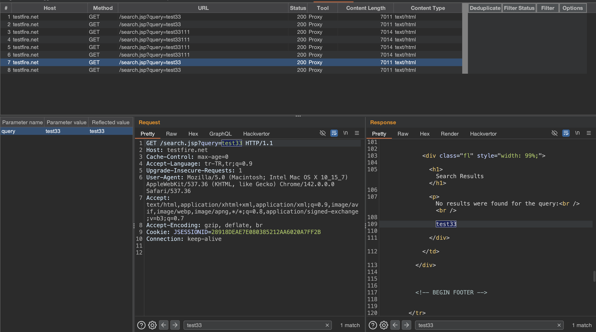
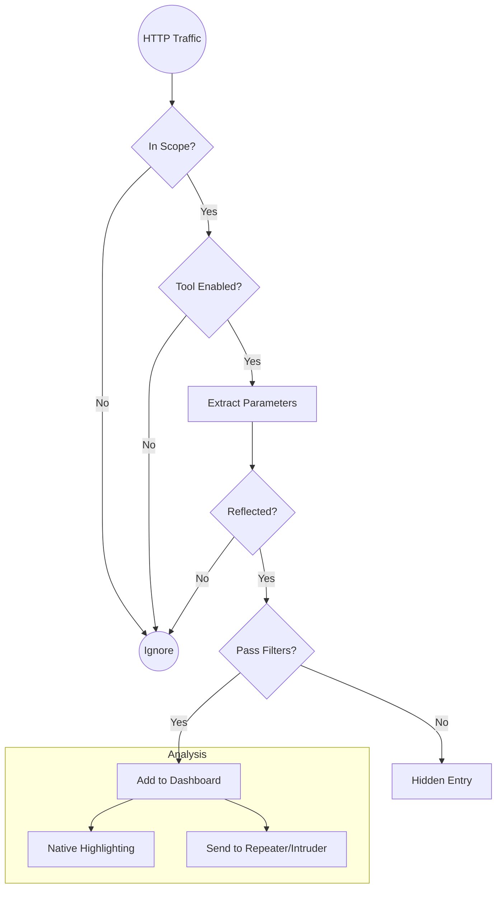

# Reflection+ - Burp Suite Extension

<p align="center">
  <strong>Advanced Reflected Parameter Detection for Security Testing</strong>
</p>

Reflection+ is a powerful Burp Suite extension designed to automatically detect, track, and analyze reflected parameters in HTTP responses. It helps security researchers and penetration testers identify potential Cross-Site Scripting (XSS) vulnerabilities by monitoring how user-supplied input is reflected back in server responses.

> **Now powered by the modern Burp Suite Montoya API!** 🚀




---

## Table of Contents

- [Why Reflection+?](#why-reflection)
- [Key Features](#key-features)
- [Installation](#installation)
- [User Interface Overview](#user-interface-overview)
- [Detailed Workflow](#detailed-workflow)
- [Feature Deep Dive](#feature-deep-dive)
- [Use Cases](#use-cases)
- [Technical Architecture](#technical-architecture)
- [Building from Source](#building-from-source)
- [Troubleshooting](#troubleshooting)
- [Version History](#version-history)
- [Author](#author)
- [License](#license)

---

## Why Reflection+?

When testing web applications for XSS vulnerabilities, one of the most time-consuming tasks is identifying where user input is reflected in responses. Reflection+ automates this process by:

1. **Monitoring all HTTP traffic** passing through Burp Suite (Proxy & Scanner)
2. **Automatically detecting** when parameter values appear in responses
3. **Highlighting exact locations** where reflections occur using native Burp search
4. **Organizing findings** in an easy-to-analyze interface
5. **Integrating seamlessly** with Burp's testing tools

This allows security testers to focus on exploitation rather than discovery, significantly speeding up the vulnerability assessment process.

---

## Key Features

### 🔍 Automatic Reflection Detection
- **Comprehensive Monitoring:** Real-time monitoring of **Proxy** and **Scanner** (formerly Spider) traffic.
- **Smart Detection:** Detection of both raw and URL-decoded parameter values.
- **Noise Reduction:** Minimum 4-character threshold to reduce false positives.
- **Scope Awareness:** Strictly respects Burp's Target Scope configuration.
- **Cookie Exclusion:** Cookie parameters automatically excluded (typically not XSS vectors).

### 🎯 Native Search Highlighting
- **Integrated Highlighting:** Leverages Burp's native search functionality to highlight reflected values in the Request and Response editors.
- **Interactive:** Selecting a parameter in the "Parameters Panel" automatically highlights its reflection in the editors.

### 📊 Advanced Filtering & Deduplication
- **Content-Type Filter:** Focus on relevant response types (HTML, JSON, JS, XML).
- **Status Code Filter:** Filter by HTTP response codes.
- **Deduplication:** Toggle to hide duplicate findings (based on URL + Status Code) for cleaner results.
- **Smart Defaults:** Automatically hides CSS, images, and fonts.

### 🔧 Burp Suite Integration
- **Intruder Integration:** Send requests to Intruder with **intelligent payload markers** placed exactly on reflected parameters.
- **Repeater Access:** Quick access to Repeater for manual testing.
- **Copy URL:** One-click URL copying for external tools.
- **Active Scan:** Initiate targeted active scans for specific requests or reflected parameters.
- **XSS Scan:** Dedicated menu options for XSS-focused scanning (currently runs full scan due to API limitations, but positioned for future granular checks).

### 📱 Modern User Interface
- **Master-Detail Layout:**
    - **Top:** Requests Table (All reflected requests)
    - **Bottom Left:** Parameters Panel (Reflected parameters for selected request)
    - **Bottom Right:** Request/Response Editors (Native Montoya editors)
- **Pixel-Perfect Design:** Exact column widths and panel dimensions for a familiar and optimized experience.
- **Bold Headers:** Clear and readable table headers.

---

## Installation

### Prerequisites

| Requirement | Version |
|-------------|---------|
| Java JDK | 17 or higher |
| Gradle | 7.0 or higher |
| Burp Suite | Professional or Community (Latest Version Recommended) |

### Building from Source

```bash
# 1. Clone the repository
git clone https://github.com/cihanmehmet/ReflectionPlus.git
cd ReflectionPlus

# 2. Build the fat JAR (includes all dependencies)
gradle clean fatJar

# 3. Find the compiled extension
ls build/libs/
# Output: ReflectionPlus-all.jar

```


### Loading into Burp Suite

1. Open Burp Suite
2. Navigate to **Extensions** → **Installed**
3. Click the **Add** button
4. Configure the extension:
   - **Extension type**: Java
   - **Extension file**: Select `build/libs/ReflectionPlus-all.jar`
5. Click **Next**
6. Verify the extension loaded successfully (check for "Reflection+" tab)

---

## User Interface Overview

The Reflection+ interface is divided into three main sections:

```
┌─────────────────────────────────────────────────────────────────────────┐
│                        REFLECTED ENTRIES TABLE                          │
│  #  │ Host │ Method │ URL │ Status │ Tool │ Length │ Type │ [Filters]  │
├─────────────────────────────────────────────────────────────────────────┤
│                                                                         │
│  ┌─────────────┐  ┌─────────────────────┬─────────────────────┐        │
│  │  PARAMETERS │  │      REQUEST        │      RESPONSE       │        │
│  │    PANEL    │  │                     │                     │        │
│  │             │  │  [Native Editor     │  [Native Editor     │        │
│  │ Name: q     │  │   with Search       │   with Search       │        │
│  │ Value: test │  │   Highlighting]     │   Highlighting]     │        │
│  │ Reflected:  │  │                     │                     │        │
│  │   test      │  │                     │                     │        │
│  └─────────────┘  └─────────────────────┴─────────────────────┘        │
└─────────────────────────────────────────────────────────────────────────┘
```


### Section 1: Reflected Entries Table (Top)

The main table displays all detected reflections with the following columns:

| Column | Description | Sortable |
|--------|-------------|----------|
| **#** | Sequential entry number | Yes |
| **Host** | Protocol and hostname (e.g., `https://example.com`) | Yes |
| **Method** | HTTP method (GET, POST, PUT, DELETE, etc.) | Yes |
| **URL** | Request path and query string | Yes |
| **Status** | HTTP response status code | Yes |
| **Tool** | Source tool (**Proxy** or **Scanner**) | Yes |
| **Content Length** | Response body size in bytes | Yes |
| **Content Type** | Response MIME type | Yes |
| **\|** | Visual separator | No |
| **Deduplicate** | Toggle deduplication on/off | No |
| **Filter Status** | Open status code filter menu | No |
| **Filter** | Open content type filter menu | No |
| **Options** | Select which tools to monitor (Proxy, Scanner, etc.) | No |

### 🔘 Button Functions

- **Deduplicate**: Toggles between "Deduplicate" and "Show All" modes.
    - **Deduplicate Mode**: Hides duplicate entries based on `Host + URL + Status Code`. Useful for seeing unique findings.
    - **Show All Mode**: Displays every single reflected response, even if identical. Useful for analyzing frequency or timing.
- **Filter Status**: Opens a menu to filter results by HTTP Status Code (e.g., show only 200 OK).
- **Filter**: Opens a menu to filter results by Content-Type (e.g., show only HTML or JSON).
- **Options**: Opens a menu to select which Burp tools to monitor.
    - **Proxy**: Monitor traffic from the Proxy tool (Browser traffic).
    - **Scanner**: Monitor traffic from the Scanner tool.
    - **Intruder**: Monitor traffic from the Intruder tool.
    - **Repeater**: Monitor traffic from the Repeater tool.
    - *Default:* Proxy and Repeater are enabled.


#### Deduplicate Button


### Section 2: Parameters Panel (Bottom Left)

Displays detailed information about reflected parameters for the selected entry. Clicking a row here triggers **Native Search Highlighting** in the editors.

| Field | Description |
|-------|-------------|
| **Parameter name** | The name of the reflected parameter |
| **Parameter value** | The original value sent in the request |
| **Reflected value** | The value as it appears in the response |

### Section 3: Request/Response Viewer (Bottom Right)

Side-by-side display using Burp's **Native Montoya Editors**. This ensures full compatibility with Burp's features (search, rendering, etc.).


---

## Detailed Workflow

### Visual Workflow



### Step 1: Configure Your Target Scope

Before using Reflection+, define your testing scope in Burp Suite:

1. Go to **Target** → **Scope**
2. Add your target domain(s) to the scope
3. This ensures Reflection+ only monitors relevant traffic

```
Example Scope Configuration:
✓ Include: https://target-application.com/*
✓ Include: https://api.target-application.com/*
✗ Exclude: https://analytics.google.com/*
```

### Step 2: Generate Traffic

Browse the target application to generate HTTP traffic:

**Option A: Manual Browsing**
- Configure your browser to use Burp Proxy
- Navigate through the application naturally
- Submit forms, click links, use search features

**Option B: Automated Scanning**
- Use Burp Scanner to crawl/audit the application
- Reflection+ monitors Scanner traffic automatically via `HttpHandler`

**Option C: Combined Approach (Recommended)**
- Start with manual browsing to understand the application
- Use Spider to discover additional endpoints
- Return to manual testing for complex functionality

### Step 3: Monitor Reflections

As traffic flows through Burp, Reflection+ automatically:

1. **Captures** each HTTP response
2. **Extracts** all parameters from the request
3. **Searches** for parameter values in the response
4. **Records** any matches as potential reflections
5. **Displays** findings in the Reflection+ tab

```
Detection Process:
Request: GET /search?q=test123&category=books
         ↓
Response: <html>...<h1>Search results for: test123</h1>...
         ↓
Detection: Parameter 'q' with value 'test123' reflected in response
         ↓
Entry Added: Host | Method | URL | Status | etc.
```

### Step 4: Analyze Findings

Click on any entry in the table to view details:

1. **Review the Parameters Panel**
   - Click on a parameter to see it highlighted in the Request/Response editors.
   - Compare original values with reflected values
   - Identify potential encoding issues

2. **Examine the Request & Response**
   - Use the native editors to inspect the context of the reflection.
   - Note the parameter location (URL, body, headers)
   - Check for any existing encoding

### Step 5: Filter and Organize

Use the filtering system to focus on relevant findings:

**Content-Type Filtering:**
```
Recommended for XSS Testing:
✓ text/html          - Primary XSS target
✓ application/json   - DOM-based XSS potential
✓ text/javascript    - Direct script injection
✗ text/css           - Rarely exploitable
✗ image/*            - Not relevant
✗ font/*             - Not relevant
```

**Status Code Filtering:**
```
Focus Areas:
✓ 200 OK             - Successful responses
✓ 302 Found          - Redirect injection
✓ 500 Error          - Error-based reflection
✗ 304 Not Modified   - Cached responses
```

**Deduplication:**
- Enable to see unique URL/status combinations only
- Useful when the same endpoint is requested multiple times
- Disable to see all instances (useful for timing analysis)

### Step 6: Test for Vulnerabilities

For each interesting reflection, test for XSS:

**Method 1: Intruder (Smart Markers)**
- Right-click → "Send request to Intruder"
- **New Feature:** Parameters are automatically marked with payload positions, saving you setup time.

**Method 2: Repeater (Manual Testing)**
- Right-click → "Send request to Repeater"
- Manually craft XSS payloads and test encoding bypasses.
- Verify exploitation

### Step 7: Document and Report

Use the gathered information for reporting:

1. **Copy URL** for documentation
2. **Screenshot** the Reflection+ interface
3. **Export** request/response from Repeater
4. **Note** the reflection context and potential impact

---

## Feature Deep Dive

### Native Search Highlighting

Unlike legacy highlighting which drew custom rectangles, Reflection+ now uses the **Montoya API's native search capability**. This means:
- Highlighting is consistent with Burp's own UI.
- It's faster and more reliable.
- It works seamlessly with large responses.

### Reflection Detection Algorithm

Reflection+ uses a sophisticated detection algorithm:

```
1. REQUEST ANALYSIS
   ├── Extract all parameters (GET, POST, etc.)
   ├── Skip cookie parameters (low XSS risk)
   └── Filter parameters < 4 characters (reduce noise)

2. VALUE PREPARATION
   ├── Store original parameter value
   └── Generate URL-decoded variant

3. RESPONSE SCANNING
   ├── Search for original value
   ├── Search for decoded value
   └── Record all match positions

4. MARKER CREATION
   ├── Mark parameter positions in request
   └── Mark reflection positions in response

5. ENTRY CREATION
   └── Store all metadata for display
```

### URL Decoding Detection

Many applications decode URL-encoded input before reflecting it:

```
Example:
Request:  ?search=%3Cscript%3E
Encoded:  %3Cscript%3E
Decoded:  <script>

Reflection+ detects BOTH:
- If "%3Cscript%3E" appears in response
- If "<script>" appears in response
```

### Smart Filtering Defaults

Default hidden content types (configurable):
- `text/css` - Stylesheets rarely reflect user input meaningfully
- `image/jpeg` - Binary content
- `font/ttf` - Font files

These defaults reduce noise while keeping potentially vulnerable content types visible.

### Thread Safety

Reflection+ is designed for high-traffic scenarios:
- Uses `CopyOnWriteArrayList` for thread-safe data storage
- Volatile variables for state management
- Non-blocking UI updates via `SwingUtilities.invokeLater()`

---

## Use Cases

### Use Case 1: Initial Reconnaissance

**Scenario**: Starting a new web application assessment

**Workflow**:
1. Set target scope
2. Spider the application
3. Review Reflection+ findings
4. Identify high-value targets (forms, search, user input)
5. Prioritize testing based on reflection context

### Use Case 2: Focused XSS Testing

**Scenario**: Testing specific functionality for XSS

**Workflow**:
1. Enable content-type filter (HTML only)
2. Interact with target functionality
3. Review reflections in real-time
4. Send interesting findings to Repeater
5. Craft and test XSS payloads

### Use Case 3: API Security Testing

**Scenario**: Testing REST API endpoints

**Workflow**:
1. Enable JSON content type
2. Make API requests with test values
3. Check for reflections in JSON responses
4. Test for DOM-based XSS in client applications
5. Check for JSON injection possibilities

### Use Case 4: Bug Bounty Hunting

**Scenario**: Efficient vulnerability discovery

**Workflow**:
1. Enable deduplication (reduce noise)
2. Browse application extensively
3. Filter by 200 status codes
4. Focus on HTML responses
5. Quickly identify and test reflections
6. Document findings for submission

---

## Technical Architecture

### Class Structure

```
BurpExtender
├── Implements
│   ├── IBurpExtender      - Extension entry point
│   ├── ITab               - Custom tab interface
│   ├── IHttpListener      - HTTP traffic monitoring
│   └── IMessageEditorController - Request/Response display
│
├── Inner Classes
│   ├── ReflectedTable     - Main findings table
│   ├── ParametersTable    - Parameter details table
│   ├── ParametersTableModel - Parameter data model
│   └── ReflectedEntry     - Immutable data object
│
└── Key Methods
    ├── processHttpMessage()  - Traffic interception
    ├── processResponse()     - Reflection detection
    ├── findReflections()     - Value searching
    └── refreshTable()        - UI updates
```

### Data Flow

```
HTTP Traffic
     │
     ▼
┌─────────────────┐
│ processHttpMessage │ ← Filters: Proxy/Spider only, In-scope only
└────────┬────────┘
         │
         ▼
┌─────────────────┐
│ processResponse │ ← Extracts parameters, searches for reflections
└────────┬────────┘
         │
         ▼
┌─────────────────┐
│ addReflectedEntry │ ← Creates entry, applies filters, updates UI
└────────┬────────┘
         │
         ▼
┌─────────────────┐
│   UI Display    │ ← Table, Parameters Panel, Request/Response
└─────────────────┘
```

### Performance Considerations

| Aspect | Implementation |
|--------|----------------|
| Memory | Immutable objects, defensive copies |
| Threading | CopyOnWriteArrayList, volatile state |
| String Search | indexOf() with position tracking |
| UI Updates | SwingUtilities.invokeLater() |

---

## Building from Source

### Requirements

- **JDK 17+**: Required for compilation
- **Gradle 7+**: Build automation

### Build Commands

```bash
# Full clean build with fat JAR (RECOMMENDED)
gradle clean fatJar

# Standard build (without dependencies)
gradle build

# Clean only
gradle clean

# Run tests (if available)
gradle test
```

### Output Files

```
build/
└── libs/
    ├── ReflectionPlus.jar        # Standard JAR
    └── ReflectionPlus-all.jar    # Fat JAR (use this one)
```

### Project Structure

```
ReflectionPlus/
├── src/
│   └── main/
│       └── java/
│           └── BurpExtender.java   # Main extension code
├── build/
│   └── libs/
│       └── *.jar                   # Compiled JARs
├── gradle/
│   └── wrapper/                    # Gradle wrapper
├── build.gradle                    # Build configuration
├── settings.gradle                 # Project settings
├── README.md                       # This file
├── CHANGELOG.md                    # Version history
├── gradlew                         # Unix build script
└── gradlew.bat                     # Windows build script
```

---

## Troubleshooting

### Extension Won't Load

**Problem**: Burp shows an error when loading the extension

**Solutions**:
1. Verify Java version: `java -version` (must be 17+)
2. Use the fat JAR (`*-all.jar`), not the standard JAR
3. Check Burp's Extensions → Errors tab for details

### No Reflections Detected

**Problem**: Traffic is flowing but no entries appear

**Solutions**:
1. Verify target is in scope (Target → Scope)
2. Check that you're using Proxy or Spider (other tools not monitored)
3. Ensure parameters have 4+ characters
4. Check content-type filters aren't hiding results

### Performance Issues

**Problem**: Burp becomes slow with many reflections

**Solutions**:
1. Enable deduplication to reduce entries
2. Use content-type filters to reduce processing
3. Clear the list periodically
4. Increase Burp's memory allocation

### UI Display Issues

**Problem**: Panels not displaying correctly

**Solutions**:
11. Resize the Burp window
12. Drag panel dividers to adjust sizes
13. Restart Burp Suite

---

## Author

**Cihan Mehmet DOĞAN**

- 📧 Email: mehmetcihandogan@gmail.com

---

## License

This project is provided for authorized security testing and research purposes only.

---

## Disclaimer

⚠️ **Important**: This tool is intended for authorized security testing only. 

- Always obtain proper written authorization before testing
- Never test systems you do not own or have permission to test
- The author is not responsible for any misuse of this software
- Use responsibly and ethically

---

## Contributing

Contributions are welcome! To contribute:

1. Fork the repository
2. Create a feature branch
3. Make your changes
4. Submit a pull request

Please include:
- Clear description of changes
- Test cases if applicable
- Updated documentation

---

## Acknowledgments

- **PortSwigger** for the excellent Burp Suite Extender API
- **Security Research Community** for inspiration and feedback
- **Open Source Contributors** for continuous improvement
- This project was developed with inspiration from the [reflected-parameters](https://github.com/PortSwigger/reflected-parameters) extension.

---

<p align="center">
  <strong>Happy Hunting! 🎯</strong>
</p>
